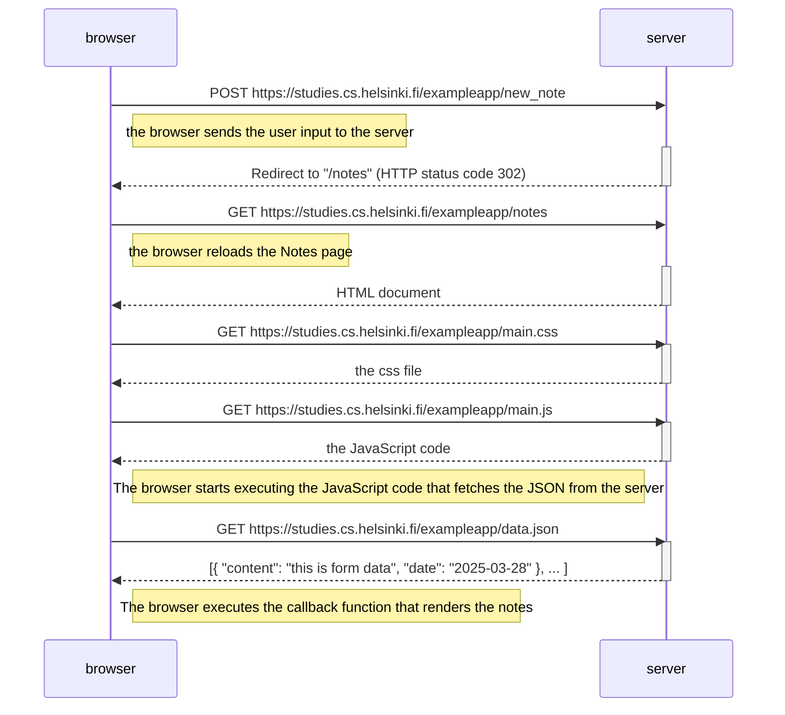

```mermaid
sequenceDiagram
    participant browser
    participant server

    browser->>server: POST https://studies.cs.helsinki.fi/exampleapp/new_note    
    Note right of browser: the browser sends the user input to the server
    activate server
    server-->>browser: Redirect to "/notes" (HTTP status code 302)    
    deactivate server
    

    browser->>server: GET https://studies.cs.helsinki.fi/exampleapp/notes
    Note right of browser: the browser reloads the Notes page
    activate server
    server-->>browser: HTML document
    deactivate server

    browser->>server: GET https://studies.cs.helsinki.fi/exampleapp/main.css
    activate server
    server-->>browser: the css file
    deactivate server

    browser->>server: GET https://studies.cs.helsinki.fi/exampleapp/main.js
    activate server
    server-->>browser: the JavaScript code
    deactivate server

    Note right of browser: The browser starts executing the JavaScript code that fetches the JSON from the server

    browser->>server: GET https://studies.cs.helsinki.fi/exampleapp/data.json
    activate server
    server-->>browser: [{ "content": "this is form data", "date": "2025-03-28" }, ... ]
    deactivate server

    Note right of browser: The browser executes the callback function that renders the notes
```
