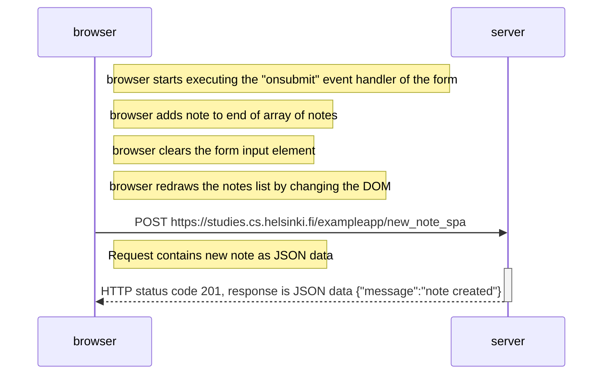

```mermaid
sequenceDiagram
    participant browser
    participant server

    Note right of browser: browser starts executing the "onsubmit" event handler of the form
    Note right of browser: browser adds note to end of array of notes
    Note right of browser: browser clears the form input element
    Note right of browser: browser redraws the notes list by changing the DOM
    browser->>server: POST https://studies.cs.helsinki.fi/exampleapp/new_note_spa
    Note right of browser: Request contains new note as JSON data
    activate server
    server-->>browser: HTTP status code 201, response is JSON data {"message":"note created"}
    deactivate server
```